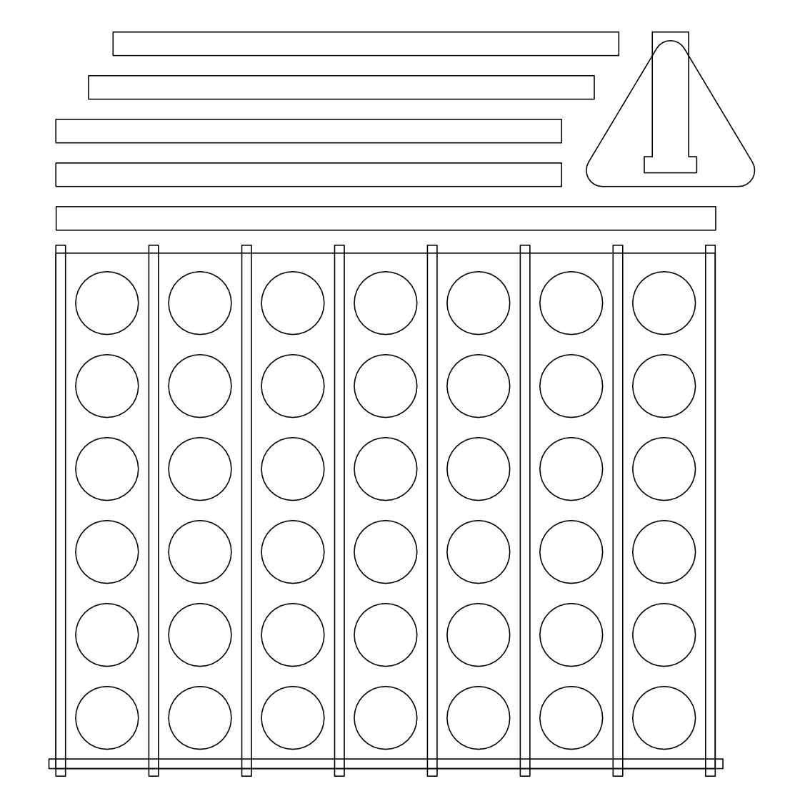

# 2gewinnt

200€ wedding gift for board game lovers

We were invited to a wedding. Bride and Broom, both board game lovers, asked for money gifts.

So we came up with a version of the classic "Connect Four" game ("Vier gewinnt") and instead of tokens we filled it with 2€-coins:

I designed the parts for the casing in Affinity Designer:

I used 3mm thick PVC hard foam sheets in blue and milled them with my Snapmaker CNC machine. You will need two sheets sized 250x250 mm and do the milling twice.

That's what the parts look like:

Since it's PVC, you can glue the parts together quite easily with plastic adhesive.

If you own a Snapmaker 2.0 A350, you can replicate this gift by loading the snapmaker file (CAM folder) directly into Snapmaker Luban software.

If you own another CNC machine, you may want to import the SVG files from the CAD folder.

Of course, you may want to tweak the gift with some decoration and wrap it in transparent foil:

We wanted to give exactly 200€, but there are only 42 slots in the game (7x6). So we put 2 coins in each slot and additional 16 before the casing.